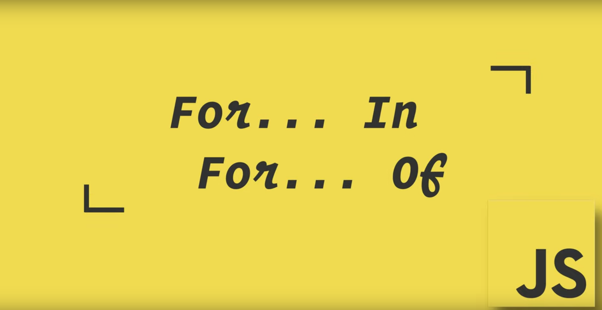
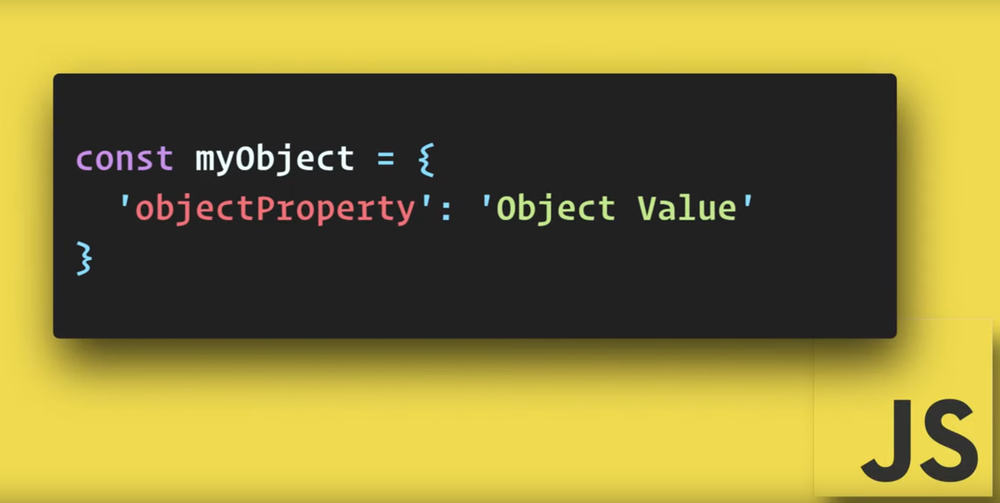
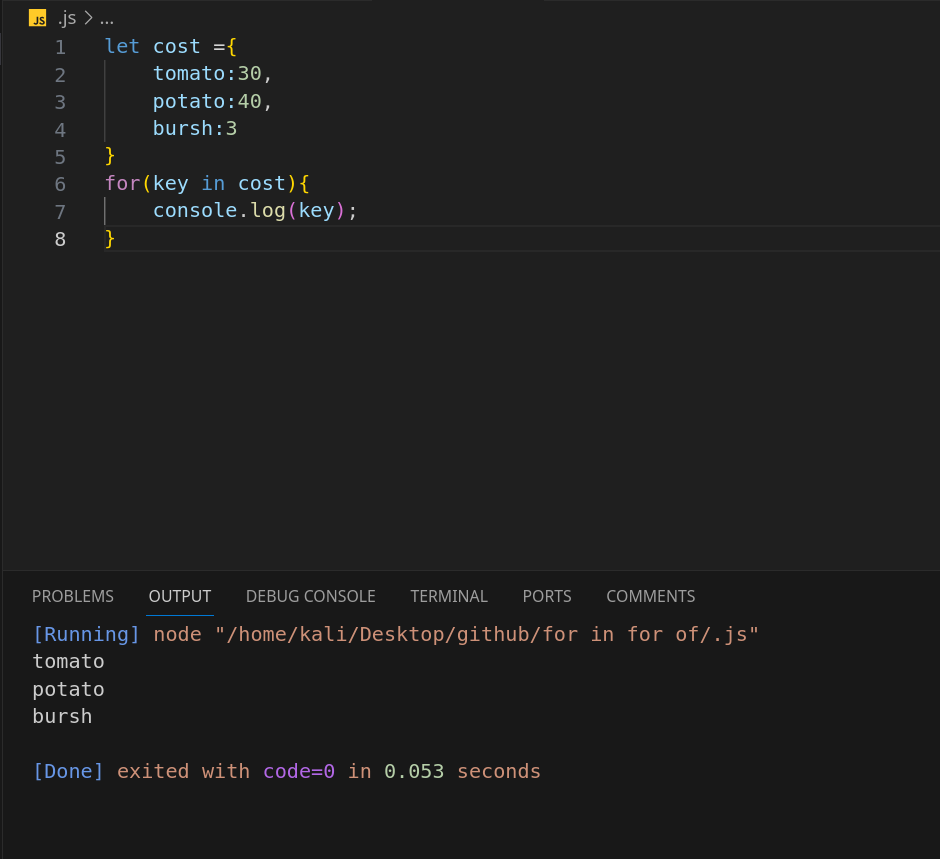
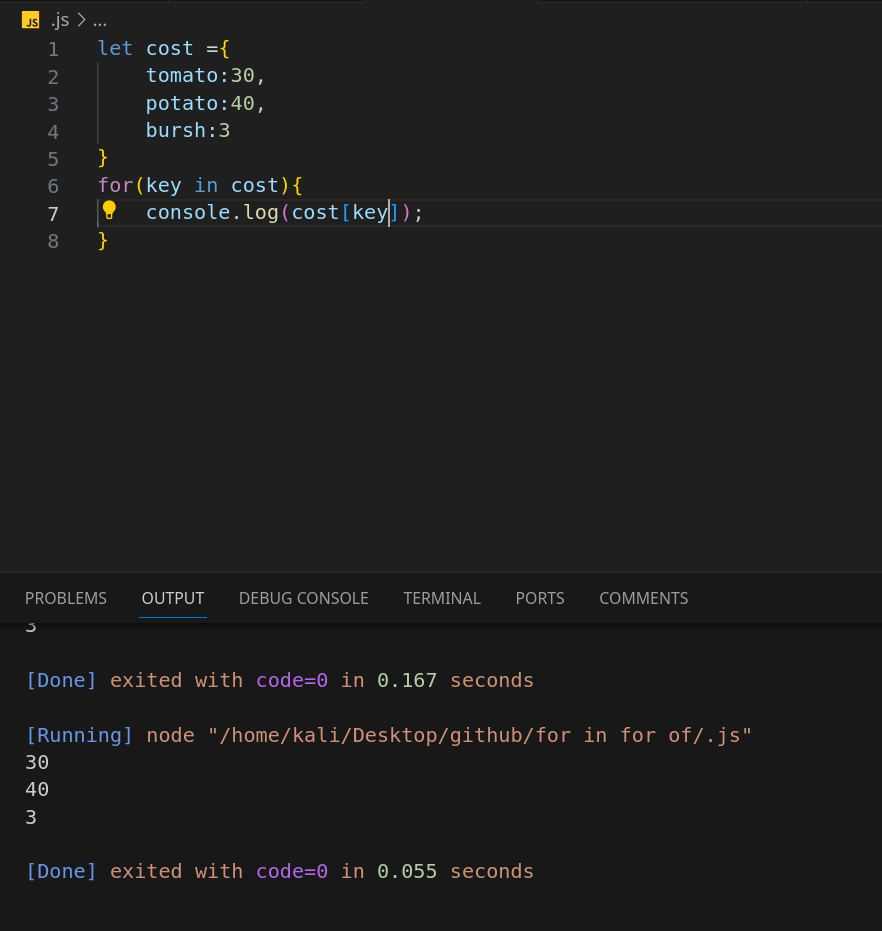
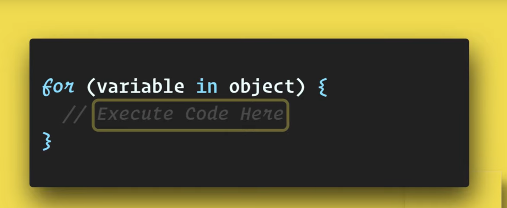
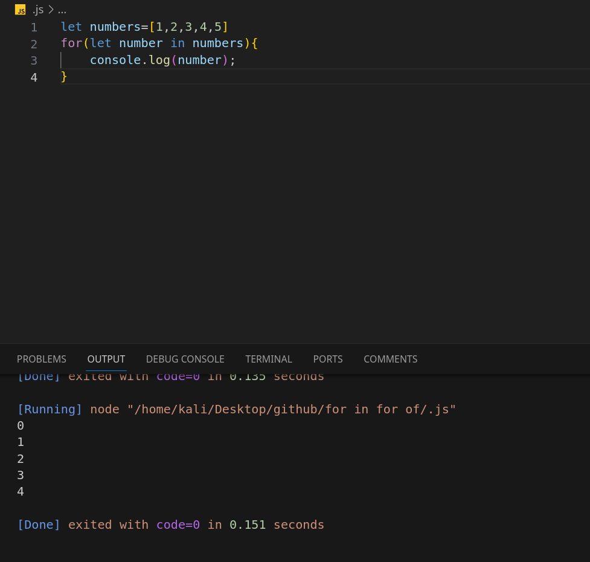
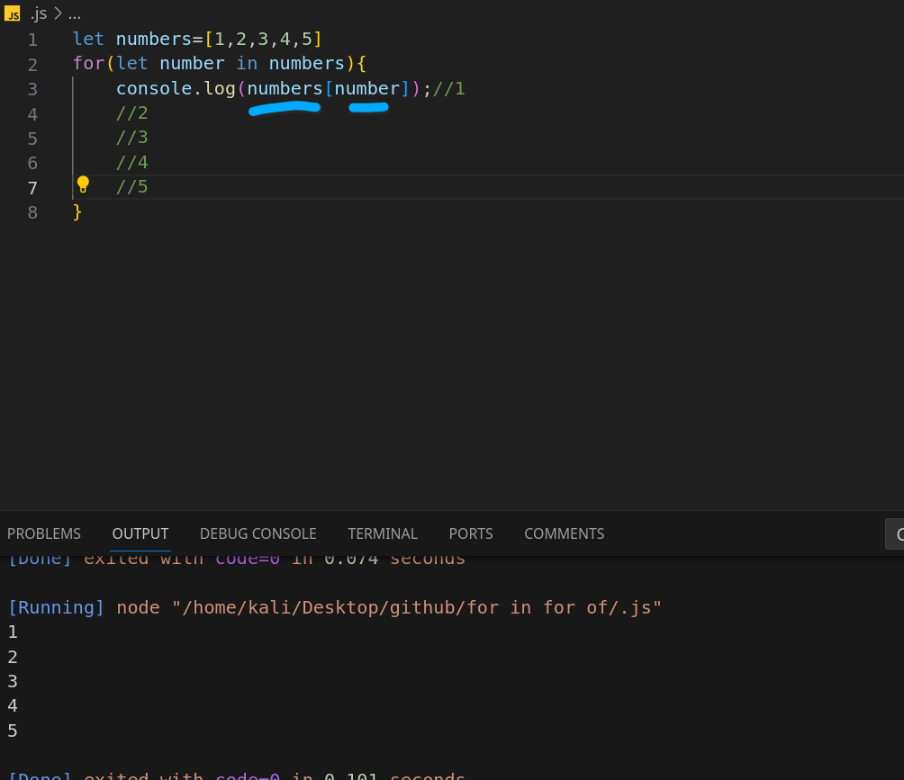
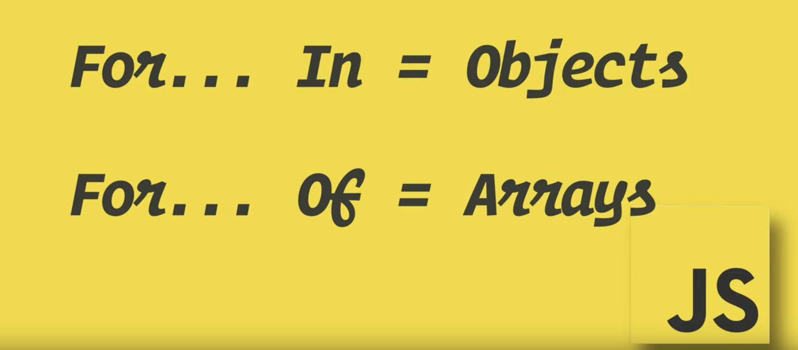
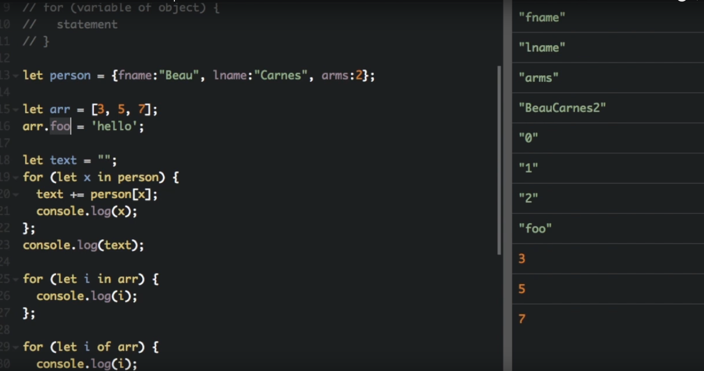

>[!TIP]
### for ... in
and
### for ... of

#### В JavaScript for...in и for...of используются для перебора коллекций, но у них разные цели и они ведут себя по-разному. `for... in`

#### Оператор for...in перебирает все перечисляемые свойства объекта, которые задаются строками (включая унаследованные перечислимые свойства).



#### for in loop baroi objectoxai rangi for id oddixai prsto baroi objectxo object propetrie dora key vallue xamiyo qati kor mekna


```js
for (variable in object) {
  // code to execute
}
```


```js
let cost ={
    tomato:30,
    potato:40,
    bursh:3
}
for(key in cost){
    console.log(key);//tomato
    //potato
    //bursh
}
```

>baroi valuowona giriftan moda ixeli darkor mewava

```js
let person = {
  name: 'John',
  age: 30,
  city: 'New York'
};

for (let key in person) {
  console.log(key + ': ' + person[key]);
}

// Output:
// name: John
// age: 30
// city: New York

```


```js
let cost ={
    tomato:30,
    potato:40,
    bursh:3
}
for(key in cost){
    console.log(cost[key]);//30
    //40
    //3
}
```





`for...of with an Array (recommended):`

```js
let array = [1, 2, 3];
for (let value of array) {
  console.log(value); // Logs 1, 2, 3
}
```
`In summary, choose for...in when you need to iterate over the properties of an object and for...of when you need to iterate over the values of an iterable.`


#### for in dar array kor mekuunad va misli for i oddi mebowad

```js
let numbers=[1,2,3,4,5]
for(let number in numbers){
    console.log(number);//0
    //1
    //2
    //3
    //4
}
```
> xamxe agar numbera log kunem indexi raqamoi loopi mora niwon meta yane aaraya
>
> agr xoxen numberrora bgiren rangi xami key in obj mekni tamom



>[!TIP]
>remember that for in is for=Object and for of is for =Arrays



### Example Comparison:
`for...in with an Array (not recommended):`
```js
let array = [1, 2, 3];
for (let index in array) {
  console.log(index); // Logs 0, 1, 2
  console.log(array[index]); // Logs 1, 2, 3
}
```


